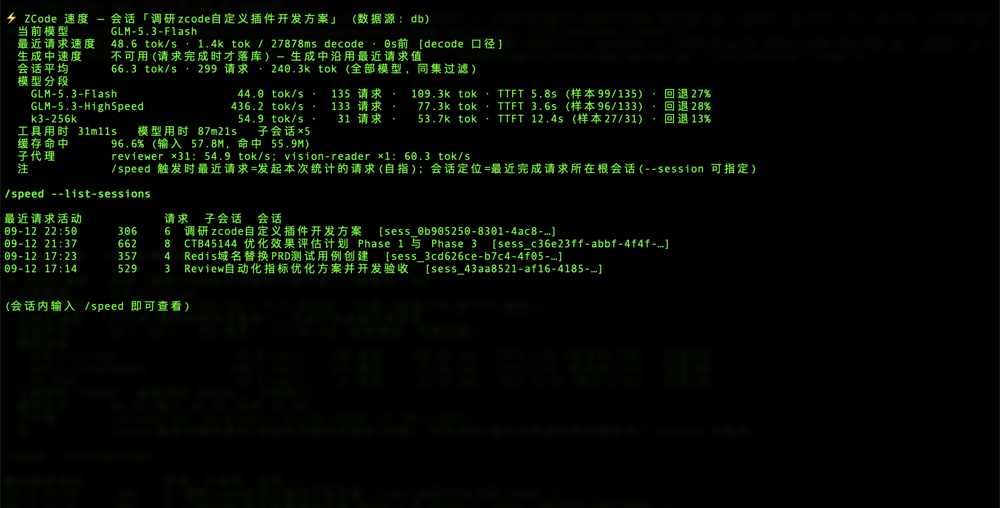
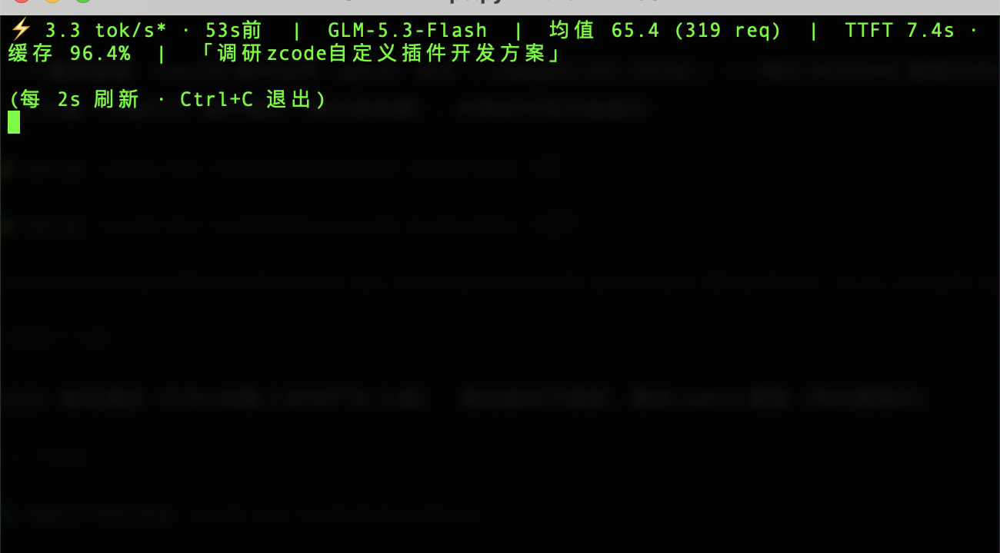

# ⚡ zcode-tps — ZCode 模型执行速度统计插件

在 [ZCode](https://zcode.z.ai) 里直观查看模型的实时执行速度：**当前请求多少 tok/s、本会话平均多少 tok/s、按模型分段统计、TTFT（首 token 延迟）、缓存命中率**，并支持多会话隔离与子代理聚合。



## 它解决什么问题

ZCode 运行时看不到模型生成速度——只能被动等结果。DSH（deepseek-harness）等工具都有速度展示，ZCode 没有内置。本插件把 ZCode 本地数据库里**已经记录好的每次模型请求指标**（输出 token 数、首 token 时间、完成时间、缓存计数）加工成一目了然的速度统计：

| 你想知道 | 插件给你 |
|---|---|
| 现在这模型跑多快？ | 最近一次请求的 tok/s（decode 口径） |
| 这个会话整体多快？ | 会话平均 tok/s（同集过滤，不虚高） |
| 会话里换过模型？ | **按模型分段**，各自累计互不污染 |
| 模型响应快不快？ | 平均 TTFT（首 token 延迟） |
| 缓存省了多少钱？ | 缓存命中率 |
| 子代理跑了多少？ | 递归聚合本会话全部子代理（含孙会话） |

数据**只读**自 ZCode 本地数据库（`~/.zcode/cli/db/db.sqlite`），不写库、不联网、无后台进程。

## 安装插件（三步，约 1 分钟）

> 前置：打开任意一个 ZCode 工作区（插件管理页需要工作区环境）。

1. **添加插件市场**：ZCode → 设置 → 插件 → 右上角 **创建 / 添加插件市场** → 填入本仓库地址：

   ```
   https://github.com/yujuntea/zcode-tps-marketplace
   ```

   （也可以先把仓库 clone 到本地，填本地目录路径。）

2. **安装插件**：在"个人"分段找到 **ZCode Tps**，点 **安装**（默认自动启用）。

3. **使用**：在任意会话输入 `/speed`，即可看到统计面板。

安装完成后，推荐按下面配置 **SwiftBar 菜单栏常驻速度**——日常体验最好的一种方式。

## ⭐ 实时查看速度的三种方式

### 方式一：macOS 菜单栏常驻（SwiftBar，最推荐）

装好后在**屏幕顶部菜单栏**常驻一个 ⚡ 实时速度，任何应用下抬头可见：


**装好后的效果：**

- 菜单栏常驻显示 `⚡ 497.0 tok/s` 这样一个数字，**每 3 秒自动刷新**——模型每完成一次请求，数字就跟着跳动
- **点击它有下拉明细**：最近一次请求（token 数/速度/多久前）、当前模型、会话平均、各模型分段速度与 TTFT、缓存命中率、工具用时、当前会话标题，还有一键「刷新」
- 多显示器环境下图标**跟随你正在使用的屏幕**，不需要任何操作

**安装配置步骤（一次性，约 3 分钟）：**

1. **生成菜单栏脚本**：在 ZCode 会话里输入：

   ```
   /speed --setup-menu
   ```

   它会把统计脚本复制到稳定路径（`~/.zcode/plugins-data/zcode-tps/tps.py`），并在专用插件目录生成菜单栏脚本（`~/.zcode/plugins-data/zcode-tps/swiftbar/zcode-tps.3s.sh`）。

2. **安装 SwiftBar**（一个开源的 macOS 菜单栏定制工具，本插件的菜单栏显示基于它）：

   ```
   brew install --cask swiftbar
   ```

   没装 Homebrew 也可以去 [swiftbar.app](https://swiftbar.app) 下载 dmg 拖进"应用程序"。

3. **选择插件目录**：首次启动 SwiftBar 会弹向导让你"选择插件目录"，选这一步 1 输出的专用目录（默认 `~/.zcode/plugins-data/zcode-tps/swiftbar`），点确定。

4. **完成**：菜单栏立即出现 ⚡ 速度。如果没有出现，按顺序排查：
   - 菜单栏显示 `SwiftBar` 占位文字而不是速度：SwiftBar 偶发不对已存在的文件做导入扫描，动一下脚本即可触发——`touch ~/.zcode/plugins-data/zcode-tps/swiftbar/zcode-tps.3s.sh`，或重启一次 SwiftBar
   - 仍不出现（SwiftBar 个别版本的首启向导有已知毛病）：执行下面一条命令再重启 SwiftBar：

     ```
     defaults write com.ameba.SwiftBar PluginDirectory "$HOME/.zcode/plugins-data/zcode-tps/swiftbar"
     ```

> 注意：插件目录请保持使用上面的专用目录，**不要**选 `~/Library/Application Support/SwiftBar`（SwiftBar 的数据根目录）——其内部的 Plugins 同步目录会被递归遍历，导致同一脚本出现两个菜单项。
>
> 插件升级后，重跑一次 `/speed --setup-menu` 刷新脚本即可。

### 方式二：ZCode 内置终端实时刷新（不想装额外软件）

> 前提：先在会话里跑一次 `/speed --setup-menu`（把脚本复制到稳定路径，一次性操作）。

把这条命令粘贴到 **ZCode 内置终端标签页**，速度行每 2 秒自动刷新，与聊天并排可见：



```
python3 ~/.zcode/plugins-data/zcode-tps/tps.py --watch
```

`Ctrl+C` 退出；追加 `--panel` 显示完整面板版。也可以直接输 `/speed --watch`，插件会把这条命令给你。

### 方式三：`/speed` 按需查看（零配置）

```
/speed                    # 当前会话统计面板（默认）
/speed --list-sessions    # 列出最近会话，方便找到想看的会话
/speed --session <id>     # 指定某个会话查看
/speed --json             # 机器可读 JSON 输出
```

## 输出示例

```
⚡ ZCode 速度 — 会话「调研zcode自定义插件开发方案」 (数据源: db)
  当前模型      GLM-5.3-Flash
  最近请求速度  48.6 tok/s · 1.4k tok / 27.9s decode · 0s前 [decode 口径]
  会话平均      66.3 tok/s · 299 请求 · 240.3k tok (全部模型, 同集过滤)
  模型分段
    GLM-5.3-Flash        44.0 tok/s · 135 请求 · 109.3k tok · TTFT 5.8s (样本99/135) · 回退27%
    GLM-5.3-HighSpeed   436.2 tok/s · 133 请求 ·  77.3k tok · TTFT 3.6s (样本96/133) · 回退28%
    k3-256k              54.9 tok/s ·  31 请求 ·  53.7k tok · TTFT 12.4s (样本27/31) · 回退13%
  工具用时 31m11s   模型用时 87m21s   子会话×5
  缓存命中      96.5% (输入 56.2M, 命中 54.3M)
  子代理        reviewer ×31: 54.9 tok/s
```

## 计算口径（重要，保证数字可信）

- **单请求 TPS** = `output_tokens / (完成时刻 − 首 token 时刻)`，与 [deepseek-harness](https://github.com/deepseek-ai/deepseek-harness) 的 decode 口径一致；约 35% 的请求 ZCode 未记录首 token 时间，这些行**回退**为 `output_tokens / 总时长`（分母含 TTFT，数值偏低），面板会标注「回退」与占比
- **会话平均**分子分母**同集过滤**（只有同时具备 token 数与 decode 时长的行才计入两侧），避免系统性偏高约 10%
- 模型分组键小写归一（数据库中 `GLM-5.3` / `glm-5.3` 大小写并存）
- 会话定位 = 最近完成请求所在的根会话（沿 `parent_id` 递归上溯）；子代理会话按树聚合
- 只统计 `main_turn` / `subagent` 请求，排除 compact、标题生成等辅助请求的污染

## 隐私与安全

- 全部数据来自本机 ZCode 数据库的**只读**查询（`mode=ro` + `query_only` 双保险）
- 不联网、不写库、无 hook、无后台进程、无第三方依赖（纯 Python 标准库）

## 已知边界

- ZCode 在**请求完成时**才落库（流式生成期间无外部可见数据），因此实时刷新为"每请求粒度"——生成中沿用最近一次速度
- 约 35% 请求无首 token 计时，回退口径数值偏低（已在面板标注）
- 数据库为 ZCode 内部实现，大版本升级后如统计报错，请更新本插件；脚本会自动探测表结构并对缺失字段降级

## 工作原理

```
ZCode (zcode-cli) ──写入──▶ ~/.zcode/cli/db/db.sqlite
                                 │ model_usage / tool_usage / session
                                 ▼
                    tps.py（只读 SQL：递归会话树 + 同集过滤 + 模型归一）
                        │                   │                │
                        ▼                   ▼                ▼
                  /speed 面板          终端 --watch      SwiftBar 菜单栏
```

## License

[MIT](LICENSE)
